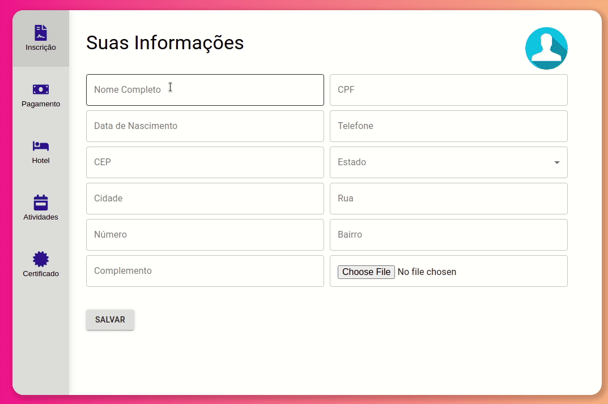

# E-vent :tickets:
A helpful tool to create events :tada:
## Preview 👀
 
#### [Click here and try it now!](https://drivent-front-lyart.vercel.app/)
## About 🔎
This is an web aplication wich users can enroll yourselves in an event, choose between online or presential, choose lodges and get a certificate.
### Implemented features :heavy_check_mark:
- [x] Enrollment
- [x] Modalities categories (online or presential)
- [x] Logde options (with hotels or not)
- [x] Choose activies
- [x] Payment page
- [x] Certificate 
### Future improvements 🔮
- [ ] Mobile version
- [ ] Dynamic data to complete certificates
- [ ] Certificate only at the end of event
## Tech tools 🔧
The following tools and frameworks were used in the construction of the project:<br>
<p>
  
  
  
  
  
</p>

## How to run ⚙️

1. Clone this repository
2. Clone the [back-end repository](https://github.com/jotabraga/e-vent-backend)
3. Follow instructions to run [back-end](https://github.com/jotabraga/e-vent-backend#readme)
4. Install dependencies
```bash
npm i
```
5. Run the front-end with
```bash
npm start
```
6. You can optionally build the project running
```bash
npm run build
```
7. Finally access http://localhost:3000 on your favorite browser 

